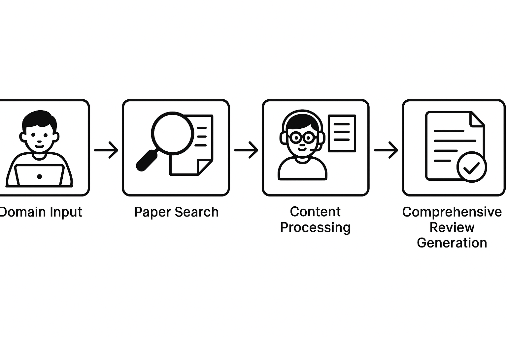
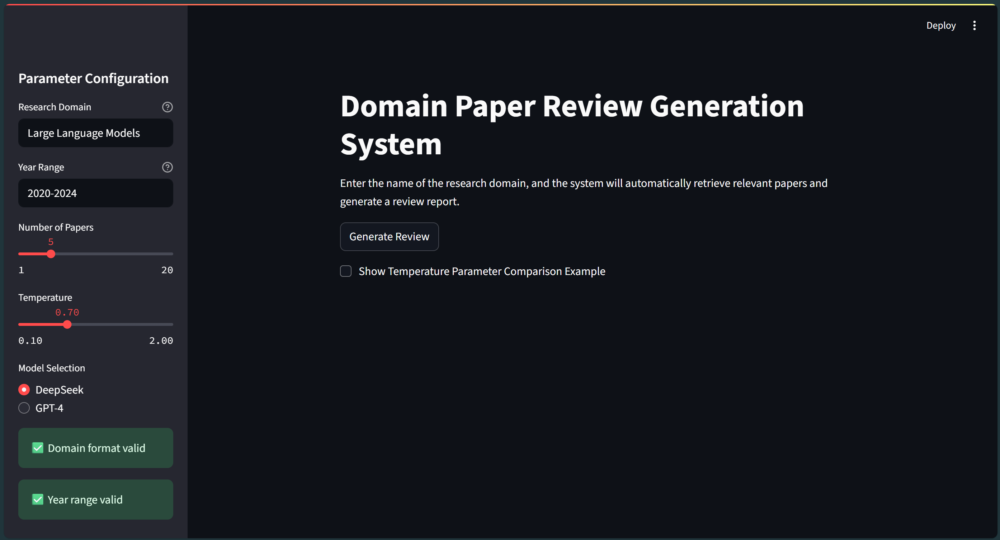

# Overview
This is a `academic review system`, designed for beginners to get the core of a new academic field. Users can put in a domain of interest and the system will collect related papers, which are then summarized into a review on this domain. For more details, view [technical report](./technical_report.md). 

## Key Modules
Main modules include: 

[paper_retriever.py](./paper_retriever.py): which is a module containing all the functions required to obtain information of papers related to an input domain. The papers are collected via Arxiv API and are then vectorized, filtered, shown and stored.

[review_generator.py](./review_generator.py): which is a module that produce a well-organized review based on the papers retrieved with the help of LLMs. 

[security.py](./security.py): the security module that involves tools for input/output security check.

[main.py](./main.py): where UI module is located, and all the modules above are synthesized to build the final system.

Other modules include:

[config.py](./config.py): where basic classes like Papers and ReviewOutput are defined

[download_model](./download_model.py): through which the embedding model is downloaded to ./local_models so that it won't be reloaded each time later

[test_security.py](./security.py): which tests whether the security module is correctly implemented

## System Archetecture


# User Interface


# Set Up
To use this academic review system, several steps are to be taken.
## Obtain API Keys
The system deploys Deepseek-Chat and GPT-4, so at least one from `Deepseek API key` and `OpenAI API key` should be obtained. 
Once you've got an API key, build a `.env` file under the current repository, whose content being
```
DEEPSEEK_API_KEY=<your_deepseek_api>
OPENAI_API_KEY=<your_openai_api>
```

## Environment Requirements
Create a virtual environment and run
```powershell
pip install -r requirements.txt
```
on the terminal under this virtual environment.

## Download Embedding Models
When filtering the collected essays, the program embeds the titles and abstracts of them with `paraphrase-multilingual-MiniLM-L12-v2`, which should be downloaded into `./local_models`. 

In order to do it, you only need to run [download_model.py](./download_model.py) by running the following codes in the terminal:
```powershell
python download_model.py
```

# Run the academic review system
Given all setups completed, run the following codes to activate the system via streamlit.
```powershell
streamlit run main.py
```
Then a user interface will be created for you to usher in academic domains.